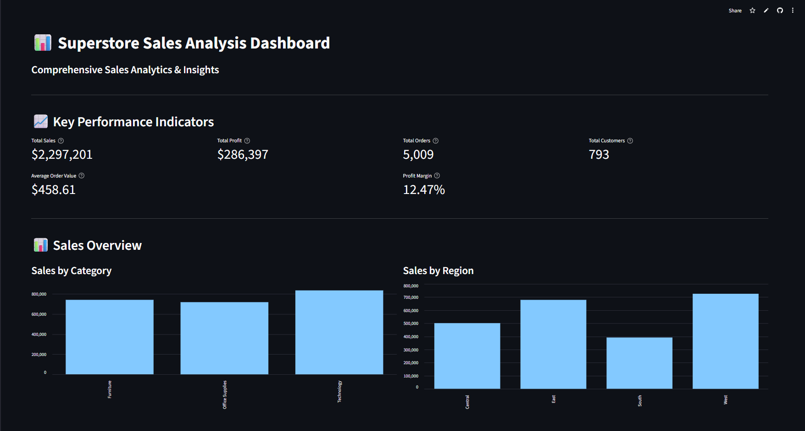
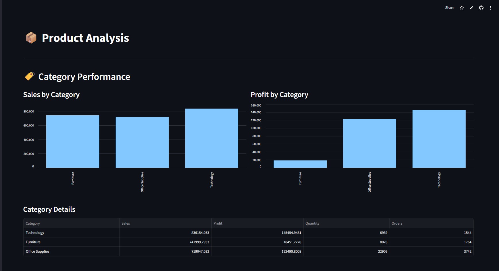

<div align="center">

# 📊 Superstore Sales Analysis Dashboard

### *Transform Sales Data into Actionable Business Intelligence*

[](https://www.python.org/)
[](https://streamlit.io/)
[](https://pandas.pydata.org/)


**[Live Demo](https://tejaskotekar04-superstore-sales-analysis-app-vmrspb.streamlit.app) • [Report Bug](https://github.com/tejaskotekar04/Superstore-Sales-Analysis/issues) • [Request Feature](https://github.com/tejaskotekar04/Superstore-Sales-Analysis/issues)**

*An interactive, multi-page web application for comprehensive sales analytics*

</div>

---

## 🌟 Overview

**Superstore Sales Analysis Dashboard** is a powerful, interactive analytics platform built with **Streamlit** that helps businesses make **data-driven decisions**. Analyze 10,000+ transactions across multiple dimensions including products, customers, regions, and time periods.

### 💡 Why This Project?

- 📈 **Real-World Application**: Solve actual business problems with data
- 🎯 **Actionable Insights**: Identify profitable products and loss-making items
- 🔍 **Deep Analysis**: 6 specialized pages covering every aspect of sales
- 🚀 **Production Ready**: Clean code, modular architecture, comprehensive documentation

---

## ✨ Key Features

<table>
  <tr>
    <td width="50%">
      
### 🏠 **Home Dashboard**
- 📊 Real-time KPIs (Sales, Profit, Orders)
- 📈 Monthly trend visualization
- 🎯 Quick business overview
- 📋 Dataset statistics

    </td>
    <td width="50%">
      
### 📦 **Product Analysis**
- 🏷️ Category performance metrics
- 🔝 Top-selling products
- 📊 Sub-category breakdown
- 🔍 Interactive filtering

    </td>
  </tr>
  <tr>
    <td width="50%">
      
### 👥 **Customer Intelligence**
- 👔 Segment analysis (B2B, B2C)
- 💰 Top revenue customers
- 📊 Purchase behavior patterns
- 🎯 Customer concentration

    </td>
    <td width="50%">
      
### 📍 **Geographic Insights**
- 🗺️ Regional performance
- 🏙️ Top states and cities
- 📊 Geographic distribution
- 🎯 Expansion opportunities

    </td>
  </tr>
  <tr>
    <td width="50%">
      
### 📈 **Trend Analysis**
- 📅 Monthly/Quarterly/Yearly trends
- 📊 YoY growth rates
- 🎯 Seasonal patterns
- 🔍 Custom date ranges

    </td>
    <td width="50%">
      
### 💰 **Profitability**
- 💵 Profit margin analysis
- ✅ Most profitable items
- ⚠️ Loss-making products
- 🚚 Shipping profitability

    </td>
  </tr>
</table>

---

## 🎯 Live Demo

### 📊 Dashboard Screenshots

<div align="center">

#### Home Dashboard


#### Product Analysis


#### Sales Trends


</div>

> 💡 **Replace these placeholders** with your actual screenshots after running the app!

---

## 🚀 Quick Start

### Prerequisites

```bash
✅ Python 3.8 or higher
✅ pip package manager
✅ Git (optional)
```

### ⚡ Installation (3 Minutes)

```bash
# 1️⃣ Clone the repository
git clone https://github.com/YOUR_USERNAME/Superstore-Sales-Analysis.git
cd Superstore-Sales-Analysis

# 2️⃣ Install dependencies (Only 2!)
pip install streamlit pandas 

# 3️⃣ Download dataset (see below ⬇️)

# 4⃣ Launch the dashboard! 🚀
streamlit run app.py
```

### 📥 Dataset Setup

<div align="center">

**⚠️ Important: CSV file not included in repository**

</div>

**Step-by-step:**

1. 🔗 **Visit Kaggle**: [Superstore Sales Dataset](https://www.kaggle.com/datasets/vivek468/superstore-dataset-final)
2. 📥 **Download** the dataset (free Kaggle account required)
3. 📂 **Extract** the ZIP file
4. ✏️ **Rename** the CSV to `superstore.csv`
5. 📁 **Place** in the `data/` folder

```
sales-analysis/
└── data/
    └── superstore.csv  ← Place here!
```


---

## 🛠️ Tech Stack

<div align="center">

| Technology | Purpose | Why? |
|:----------:|:-------:|:----:|
|  | Web Framework | Rapid development, native charts |
|  | Data Analysis | Powerful data manipulation |

</div>

**Pure Python Implementation** - No complex dependencies!

---

## 📊 Dataset Information

<div align="center">

### 📈 Superstore Sales Dataset

[](https://www.kaggle.com/datasets/vivek468/superstore-dataset-final)

**10,000+ transactions • 21 columns • 4 years of data**

</div>

<details>
<summary>📋 <b>Click to view all columns</b></summary>

<br>

| Column | Type | Description |
|--------|------|-------------|
| `Row ID` | Integer | Unique row identifier |
| `Order ID` | String | Unique order identifier |
| `Order Date` | Date | Date when order was placed |
| `Ship Date` | Date | Date when order was shipped |
| `Ship Mode` | String | Shipping method used |
| `Customer ID` | String | Unique customer identifier |
| `Customer Name` | String | Name of the customer |
| `Segment` | String | Customer segment (Consumer/Corporate/Home Office) |
| `Country` | String | Country of order |
| `City` | String | City of delivery |
| `State` | String | State of delivery |
| `Postal Code` | String | Postal code |
| `Region` | String | Geographic region (East/West/Central/South) |
| `Product ID` | String | Unique product identifier |
| `Category` | String | Product category |
| `Sub-Category` | String | Product sub-category |
| `Product Name` | String | Name of the product |
| `Sales` | Float | Sales amount ($) |
| `Quantity` | Integer | Quantity ordered |
| `Discount` | Float | Discount percentage |
| `Profit` | Float | Profit earned ($) |

**Date Range:** 2014-2017 | **Geographic Coverage:** United States (4 regions, 49 states, 500+ cities)

</details>

---

## 💻 Project Structure

```
📦 sales-analysis-dashboard/
┣ 📂 data/
┃ ┗ 📄 superstore.csv          # Dataset (download separately)
┣ 📂 pages/                     # Multi-page Streamlit app
┃ ┣ 📄 product_analysis.py   # Product insights 
┃ ┣ 📄 customer_analysis.py  # Customer patterns 
┃ ┣ 📄 regional_analysis.py  # Geographic trends 
┃ ┣ 📄 sales_trends.py       # Time analysis
┃ ┗ 📄 profitability_analysis.py  # Profit metrics 
┣ 📄 app.py                     # Home dashboard 
┣ 📄 analysis.py                # Analysis functions
┣ 📄 visualizations.py          # Chart functions 
┣ 📄 .gitignore                 # Git ignore rules
┣ 📄 README.md                  # You are here! 📍
┗ 📄 LICENSE                    # MIT License
```

---

## 🎨 Usage Guide

### 🧭 Navigation

<div align="center">

**Use the sidebar to navigate between pages** 👈

</div>

```
🏠 Home              → Overview & key metrics
📦 Product Analysis  → Category & product insights
👥 Customer Analysis → Segmentation & behavior
📍 Regional Analysis → Geographic performance
📈 Sales Trends      → Time-based analysis
💰 Profitability     → Profit & loss metrics
```

### 🎛️ Interactive Features

- **Sliders** 🎚️: Adjust display count (5-20 items)
- **Dropdowns** 📋: Filter by category, region, segment
- **Date Pickers** 📅: Custom date range analysis
- **Real-time Updates** 🔄: Charts update automatically

---

## 📈 Business Insights You'll Discover

<table>
  <tr>
    <td align="center" width="33%">
      <h3>💰 Financial</h3>
      <ul align="left">
        <li>Total revenue & profit</li>
        <li>Profit margins by category</li>
        <li>Loss-making products</li>
        <li>ROI by region</li>
      </ul>
    </td>
    <td align="center" width="33%">
      <h3>📊 Performance</h3>
      <ul align="left">
        <li>Top products & categories</li>
        <li>Best-performing regions</li>
        <li>Peak sales periods</li>
        <li>Growth trends</li>
      </ul>
    </td>
    <td align="center" width="33%">
      <h3>🎯 Strategy</h3>
      <ul align="left">
        <li>Expansion opportunities</li>
        <li>Product optimization</li>
        <li>Customer targeting</li>
        <li>Inventory planning</li>
      </ul>
    </td>
  </tr>
</table>

---

## 🏆 Project Highlights

<div align="center">

### Why This Project Stands Out

</div>

```diff
+ 🎯 Real business value: Solves actual sales analysis problems
+ 💡 Production-ready: Clean, modular, well-documented code
+ 🚀 Fast & efficient: Optimized with caching, handles 10K+ rows
+ 📱 User-friendly: Intuitive interface, interactive filters
+ 🔧 Maintainable: Each component < 180 lines, easy to modify
+ 📚 Well-documented: Comprehensive README, setup guides
+ ✅ Best practices: .gitignore, LICENSE, proper Git workflow
```

**Perfect for:**
- 📄 **Resume/Portfolio**: Demonstrates full-stack data skills
- 🎓 **Learning**: Hands-on practice with real data
- 💼 **Interviews**: Great project to discuss
- 🚀 **Deployment**: Ready to deploy on Streamlit Cloud


## 📊 Code Quality

<div align="center">


</div>

**Features:**
- ✅ Modular architecture
- ✅ Comprehensive error handling
- ✅ Type hints where applicable
- ✅ Detailed comments
- ✅ Consistent code style
- ✅ Reusable functions

---

## 🗺️ Roadmap

<details>
<summary>🚀 <b>Planned Features</b> (Click to expand)</summary>

<br>

- [ ] 📊 Export reports to PDF
- [ ] 📧 Email alerts for metrics
- [ ] 🤖 ML-based sales forecasting
- [ ] 🗄️ Database integration (PostgreSQL)
- [ ] 🔐 User authentication
- [ ] 🌙 Dark mode support
- [ ] 📱 Mobile-responsive improvements
- [ ] 🔔 Real-time data updates
- [ ] 📊 Custom dashboard builder
- [ ] 🌍 Multi-language support

</details>

---

## 📄 License

<div align="center">

Distributed under the **MIT License**. See [`LICENSE`](LICENSE) for more information.

[](LICENSE)

</div>

---

## 📧 Contact & Support

<div align="center">

### 💬 Get in Touch

[](https://github.com/tejaskotekar04)
[](https://www.linkedin.com/in/tejas-kotekar-0302b6227/)
[](mailto:tejaskotekar04@gmail.com)


</div>

---

## 🙏 Acknowledgments

<div align="center">

**Special Thanks To:**

[](https://www.kaggle.com/datasets/vivek468/superstore-dataset-final) • Dataset Provider

[](https://streamlit.io/) • Framework

[](https://pandas.pydata.org/) • Data Processing

</div>

---

## 📚 Additional Resources

<div align="center">

**Learn More:**

[Streamlit Docs](https://docs.streamlit.io/) • [Pandas Guide](https://pandas.pydata.org/docs/) • [Python Tutorial](https://docs.python.org/3/tutorial/)

</div>

---

<div align="center">

## ⭐ Show Your Support

**If you find this project useful, please consider giving it a star!**

[](https://github.com/tejaskotekar04/Superstore-Sales-Analysis)

---

### 🚀 Ready to analyze your data?

**[Get Started Now](#-quick-start) • [Report Issues](https://github.com/tejaskotekar04/sales-analysis/issues)**

---

**Built with ❤️ by [Tejas Kotekar](https://github.com/tejaskotekar04)**

*Making data analysis accessible to everyone* 📊

---


</div>
